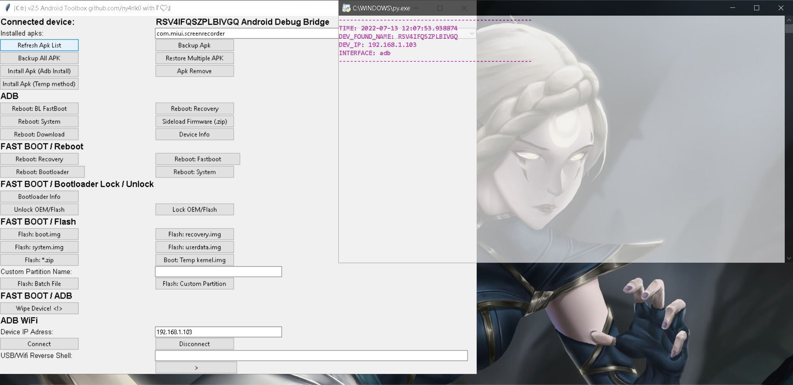
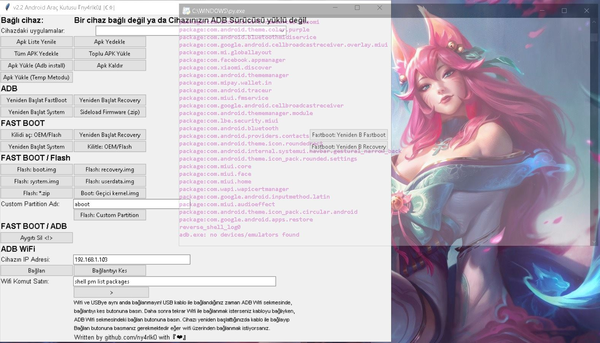

# Nyarlko-s-Android-Toolbox
Hepsi bir arada android alet çantası. 
 All in one android toolbox. Backup / Restore entire apks in single device or folder, from usb or wifi. Wifi over ADB / USB ADB /  Fastboot / flash /  lock / unlock / wipe / boot recovery , temp boot to kernel etc.
 Wifi Reverse Shell works as 2 seperate command line.
 If your device in fastboot mode it will use fastboot.exe
 If your device in ADB debugging mode it will use adb.exe
 * Note:
 Don't forget to install your ADB / FASTBOOT drivers...
  * Screen Shots:

    
    
